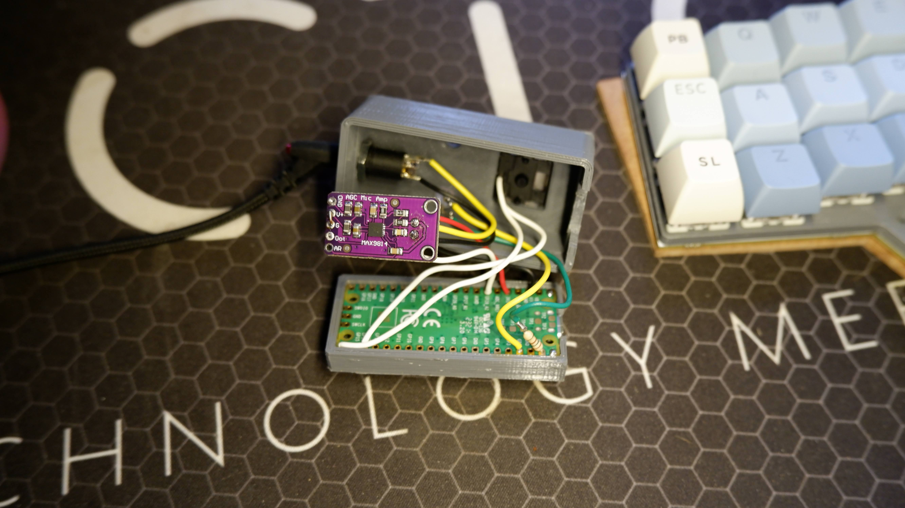
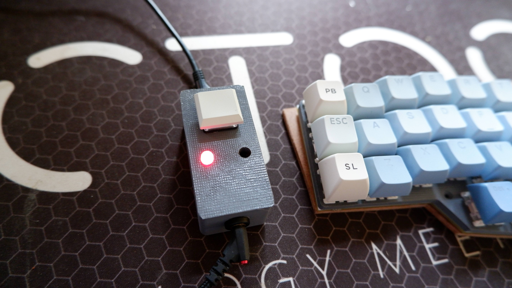

# Universal mute button 
Problem: Finding the mute/unmute button during online calls
Proposed solution: Raspberry Pi Pico as USB microphone interface with digital mute

Pro's:
- A physical button with a physical light indicator is much more human than their virtual counterparts. And talking is a human thing.
- Independent of OS or chat application
- Digital mute won't cause scratching artifact sounds that analog switches do.
- Cheap

Con's:
- Requires a physical microphone with a 3.5mm interface.

## Prototype





--------------------------------------------------------------------------------
# Original README

# Microphone Library for Pico

Capture audio from a microphone on your [Raspberry Pi Pico](https://www.raspberrypi.org/products/raspberry-pi-pico/) or any [RP2040](https://www.raspberrypi.org/products/rp2040/) based board. 🎤


## Hardware

 * RP2040 board
   * [Raspberry Pi Pico](https://www.raspberrypi.org/products/raspberry-pi-pico/)
 * Microphones
   * Analog
     * [Electret Microphone Amplifier - MAX9814 with Auto Gain Control](https://www.adafruit.com/product/1713) 
   * PDM
     * [Adafruit PDM MEMS Microphone Breakout](https://www.adafruit.com/product/3492)

### Default Pinout

#### Analog Microphone

| Raspberry Pi Pico / RP2040 | Analog Microphone |
| -------------------------- | ----------------- |
| 3.3V | VCC |
| GND | GND |
| GPIO 26 | OUT |

#### PDM Microphone

| Raspberry Pi Pico / RP2040 | PDM Microphone |
| -------------------------- | ----------------- |
| 3.3V | VCC |
| GND | GND |
| GND | SEL |
| GPIO 2 | DAT |
| GPIO 3 | CLK |

GPIO pins are configurable in examples or API.

## Examples

See [examples](examples/) folder.


## Cloning

```sh
git clone https://github.com/ArmDeveloperEcosystem/microphone-library-for-pico.git 
```

## Building

1. [Set up the Pico C/C++ SDK](https://datasheets.raspberrypi.org/pico/getting-started-with-pico.pdf)
2. Set `PICO_SDK_PATH`
```sh
export PICO_SDK_PATH=/path/to/pico-sdk
```
3. Create `build` dir, run `cmake` and `make`:
```
mkdir build
cd build
cmake .. -DPICO_BOARD=pico
make
```
4. Copy example `.uf2` to Pico when in BOOT mode.

## License

[Apache-2.0 License](LICENSE)

## Acknowledgements

This project was created on behalf of the [Arm Software Developers](https://developer.arm.com/) team, follow them on Twitter: [@ArmSoftwareDev](https://twitter.com/armsoftwaredev) and YouTube: [Arm Software Developers](https://www.youtube.com/channel/UCHUAckhCfRom2EHDGxwhfOg) for more resources!

The [OpenPDM2PCM](https://os.mbed.com/teams/ST/code/X_NUCLEO_CCA02M1//file/53f8b511f2a1/Middlewares/OpenPDM2PCM/) library is used to filter raw PDM data into PCM. The [TinyUSB](https://github.com/hathach/tinyusb) library is used in the `usb_microphone` example.

---

Disclaimer: This is not an official Arm product.
